# Jenkins CI/CD Project — Setup Report

This report documents how a full **CI/CD pipeline** was built for a Java Maven application. All actions were performed manually from the AWS Console, Jenkins, SonarQube, Nexus, and a local terminal.

The sample application repository is on GitHub: [jenkins-ci-sample-app](https://github.com/SamParsakian/jenkins-ci-sample-app)

---

## Project goal

The goal was to build an **end-to-end Jenkins CI/CD setup** that:

- Hosted on **AWS EC2**
- **Java Maven** application built and tested from **GitHub**
- **Code quality checks** with **SonarQube**
- Build artifacts stored in **Nexus Repository Manager**

---

## Architecture

Three separate Ubuntu servers were used (same AWS region and VPC):

```text
GitHub (jenkins-ci-sample-app)
        |
        v
+---------------------+
| Jenkins controller  |  port 8080
| ci-jenkins-controller
+----------+----------+
           |
     +-----+-----+
     |           |
     v           v
+------------+ +------------+
| SonarQube  | | Nexus OSS  |
| port 9000  | | port 8081  |
+------------+ +------------+
```

| Server | Role | Port |
|---|---|---|
| `ci-jenkins-controller` | Jenkins, Freestyle job, Pipeline job | 8080 |
| `sonarqube-ci-server` | SonarQube Community Edition | 9000 |
| `nexus-ci-server` | Nexus Repository OSS | 8081 |

Jenkins was configured to reach SonarQube and Nexus over **private IPs inside the VPC**. **Public IPs** were used from a browser for the web UIs.

---

## Jenkins setup (summary)

| Item | Value |
|---|---|
| Jenkins version | 2.555.2 (LTS) |
| Global tools | `Maven-3.9`, `JDK-21`, `SonarQube-Scanner` |
| Freestyle job | `build-maven-sample-app` |
| Pipeline job | `pipeline-maven-sample-app` (root `Jenkinsfile`) |
| SonarQube server name | `SonarQube-Server` |
| Nexus credential ID | `nexus-admin-creds` |

---

## Freestyle job (summary)

Job **`build-maven-sample-app`** was configured to pull the GitHub repository, run **`mvn clean package`** with **`Maven-3.9`** and **`JDK-21`**, and archive **`target/*.jar`**.

---

## Pipeline as Code (summary)

Job **`pipeline-maven-sample-app`** was configured to load the root **`Jenkinsfile`** from the sample app repository with these stages:

1. Checkout  
2. Build and Test (`mvn clean package`)  
3. Run App Smoke Test (`java -jar` — app output in console log)  
4. SonarQube Analysis (`sonar-scanner` with separate main/test sources and Java libraries)  
5. Archive Artifact (`target/*.jar`)  
6. Upload to Nexus (`mvn deploy:deploy-file`)

---

## SonarQube integration (summary)

- SonarQube Scanner plugin was installed in Jenkins  
- Credential ID **`sonarqube-token`** was created (token value stored only in Jenkins)  
- Project key **`jenkins-ci-sample-app`** was registered  
- Jenkins SonarQube server URL was set to the **private VPC IP** (connection via public IP failed from the controller)  
- The scanner was pointed at **`src/main/java`** and **`src/test/java`** as separate main/test sources  
- Quality Gate **Passed** on successful builds when no new code issues were introduced  

---

## Nexus artifact upload (summary)

- Nexus OSS was installed on **`nexus-ci-server`** (Java **11** was required for this version)  
- Repositories **`jenkins-maven-releases`** (Release) and **`jenkins-maven-snapshots`** (Snapshot) were created  
- Application version **`1.0-SNAPSHOT`** was published to **`jenkins-maven-snapshots`**  
- The first upload attempt used the **`curl`** REST API and returned **HTTP 400** (snapshot repositories required a Maven client)  
- Upload was corrected with **`mvn deploy:deploy-file`** and credential **`nexus-admin-creds`**  
- **Build #11** finished with **SUCCESS**; the artifact path was confirmed in Nexus  

---

## Final CI flow

```text
GitHub (jenkins-ci-sample-app)
  -> Jenkins Pipeline (pipeline-maven-sample-app)
  -> Maven build and test
  -> Smoke test (java -jar console output)
  -> SonarQube analysis (Quality Gate)
  -> Jenkins archives JAR
  -> Nexus upload (jenkins-maven-snapshots)
```

---

## How to read this report

A brief summary is in [README.md](README.md).

The sections below record the work in order (**Steps 1–69**). Screenshots are stored in the [`screenshots/`](screenshots/) folder and linked from the steps where they exist. A full screenshot index is at the end of this file.

---

## Phase 1 — EC2 Instance Setup

### Step 1 — AWS Console Was Opened

The AWS Management Console was opened and the **EC2** dashboard was navigated to. The **Europe (Stockholm) — eu-north-1** region was selected.

---

### Step 2 — A New Instance Was Launched

The **Launch instance** button was clicked to begin creating a new virtual server.

---

### Step 3 — The Instance Was Named

The instance was named **`ci-jenkins-controller`**.

---

### Step 4 — The Operating System Was Selected

**Ubuntu Server 24.04 LTS (64-bit x86)** was selected as the Amazon Machine Image (AMI).

---

### Step 5 — The Instance Type Was Chosen

The instance type **`t3.medium`** was selected to provide sufficient resources for running Jenkins.

---

### Step 6 — A Key Pair Was Created

A new key pair was created with the following settings:

| Setting | Value |
|---|---|
| Key pair name | `ci-jenkins-key` |
| Key pair type | RSA |
| File format | `.pem` |

The private key file was downloaded and saved to a secure local folder.

---

### Step 7 — Network and Security Were Configured

A security group was created with the following settings:

| Setting | Value |
|---|---|
| Security group name | `ci-jenkins-sg` |
| Description | Security group for Jenkins CI controller access |

The following inbound rules were added:

| Port | Protocol | Source | Purpose |
|---|---|---|---|
| 22 | SSH | My IP | Server access |
| 8080 | Custom TCP | My IP | Jenkins web UI |

---

### Step 8 — Storage Was Configured

The root volume was configured with **20 GiB** of **gp3** storage.

---

### Step 9 — The Instance Was Launched

The **Launch instance** button was clicked to create the server.

---

### Step 10 — The Instance Status Was Verified

The EC2 **Instances** page was opened to confirm the instance was in a **Running** state with **2/2 status checks passed**.

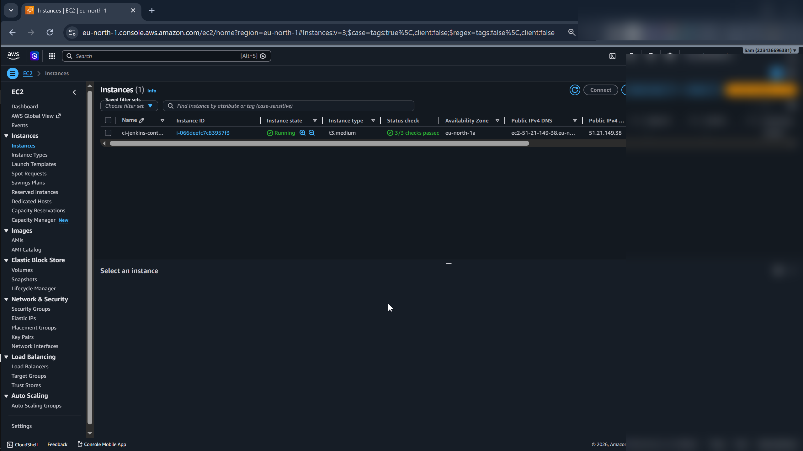

---

## Phase 2 — Server Connection and Jenkins Installation

### Step 11 — The Running Instance Was Selected

The running **`ci-jenkins-controller`** instance was selected from the EC2 instances list.

---

### Step 12 — Connection Details Were Opened

The **Connect** button was clicked and the **SSH client** tab was opened to view the connection instructions.

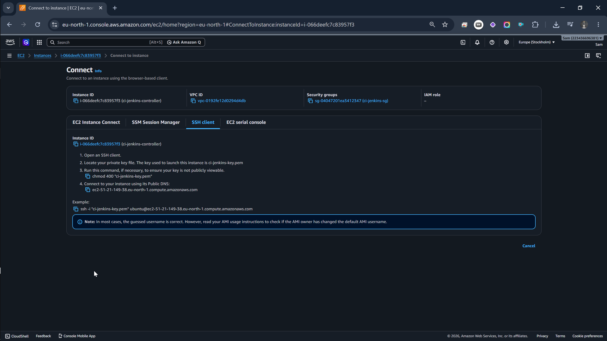

---

### Step 13 — The SSH Command Was Copied

The example SSH command was copied from the AWS connection page:

```bash
ssh -i "ci-jenkins-key.pem" ubuntu@ec2-51-21-149-38.eu-north-1.compute.amazonaws.com
```

---

### Step 14 — The Local Terminal Was Opened

A terminal was opened on the local machine and the directory containing the `.pem` key file was navigated to:

```bash
cd /path/to/key-directory
ls
```

The presence of `ci-jenkins-key.pem` was confirmed.

---

### Step 15 — Key Permissions Were Set

The private key file permissions were restricted:

```bash
chmod 400 ci-jenkins-key.pem
```

---

### Step 16 — A Connection to the Server Was Established

The SSH connection to the EC2 instance was made:

```bash
ssh -i "ci-jenkins-key.pem" ubuntu@51.21.149.38
```

The host fingerprint was accepted on first connection. A successful login was confirmed.

---

### Step 17 — The Server Was Updated

The package lists and installed packages were updated:

```bash
sudo apt update && sudo apt upgrade -y
```

---

### Step 18 — Java Was Installed

OpenJDK was installed as a prerequisite for Jenkins:

```bash
sudo apt install fontconfig openjdk-17-jre -y
sudo apt install openjdk-21-jre -y
```

OpenJDK 21 was required by Jenkins LTS 2.555.x, so both versions were installed on the server.

---

### Step 19 — The Java Installation Was Verified

The installed Java version was checked:

```bash
java -version
```

OpenJDK 21 was confirmed as the active version.

---

### Step 20 — The Official Jenkins Documentation Was Consulted

The [Jenkins Linux installation guide](https://www.jenkins.io/doc/book/installing/linux/) was reviewed for the correct repository and package installation commands.

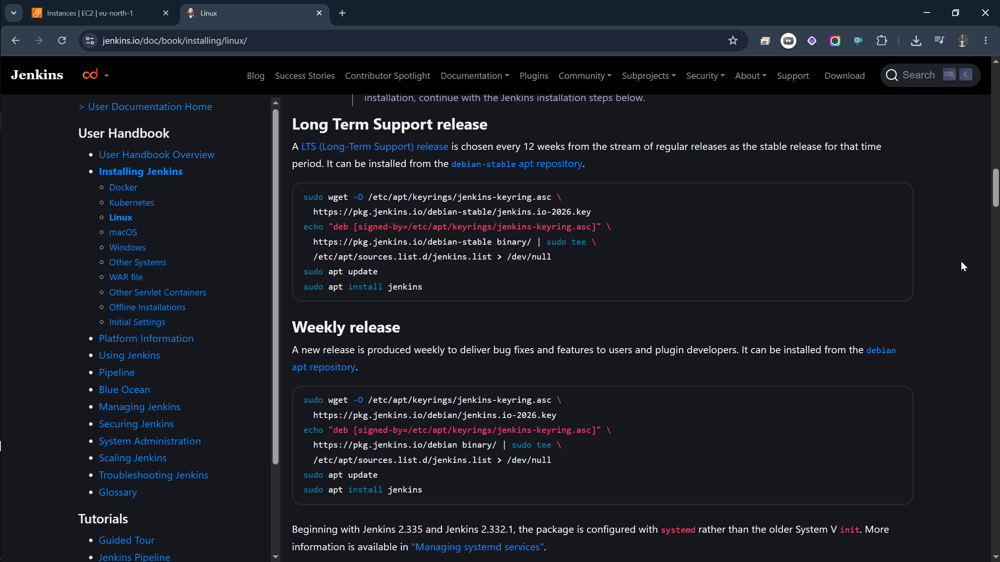

---

### Step 21 — The Jenkins Repository Key Was Added

The Jenkins GPG signing key was downloaded:

```bash
sudo wget -O /etc/apt/keyrings/jenkins-keyring.asc \
  https://pkg.jenkins.io/debian-stable/jenkins.io-2026.key
```

The updated `jenkins.io-2026.key` was used because the older 2023 key had expired.

---

### Step 22 — The Jenkins Repository Was Added

The Jenkins APT repository was added to the system:

```bash
echo "deb [signed-by=/etc/apt/keyrings/jenkins-keyring.asc] \
  https://pkg.jenkins.io/debian-stable binary/" | \
  sudo tee /etc/apt/sources.list.d/jenkins.list > /dev/null
```

The package lists were refreshed:

```bash
sudo apt update
```

---

### Step 23 — Jenkins Was Installed

Jenkins was installed from the configured repository:

```bash
sudo apt install jenkins -y
```

---

### Step 24 — Jenkins Was Configured and Started

Jenkins was configured to use Java 21, enabled on boot, and started:

```bash
echo "JAVA_HOME=/usr/lib/jvm/java-21-openjdk-amd64" | sudo tee /etc/default/jenkins
sudo systemctl enable jenkins
sudo systemctl start jenkins
```

---

### Step 25 — The Jenkins Service Status Was Checked

The running state of the Jenkins service was verified:

```bash
sudo systemctl status jenkins
```

The output showed **`Active: active (running)`**.

---

### Step 26 — The Initial Admin Password Was Retrieved

The one-time administrator password was retrieved from the server:

```bash
sudo cat /var/lib/jenkins/secrets/initialAdminPassword
```

The password was copied for use in the setup wizard.

---

### Step 27 — Jenkins Was Accessed in the Browser

The Jenkins web interface was opened at:

```
http://51.21.149.38:8080
```

The **Unlock Jenkins** page was displayed. The initial admin password was entered and **Continue** was clicked.

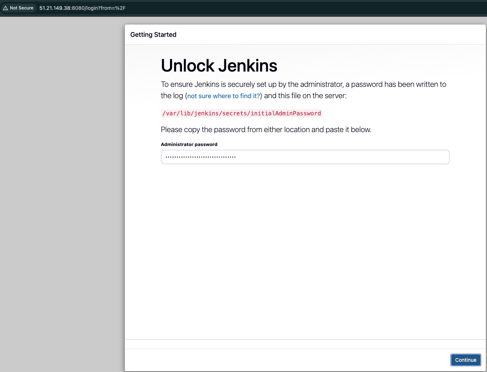

---

### Step 28 — Suggested Plugins Were Installed

**Install suggested plugins** was selected on the setup wizard. The recommended plugin set was downloaded and installed automatically.

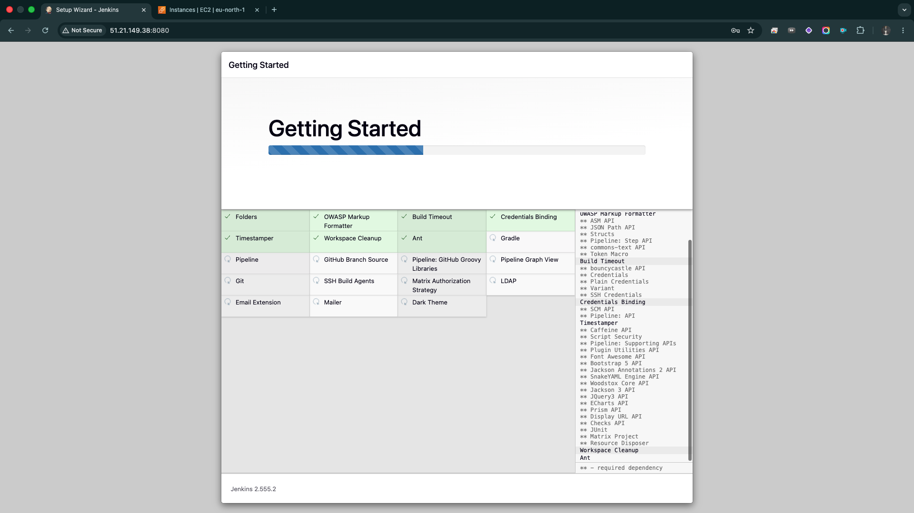

---

### Step 29 — An Administrator User Was Created

On the **Create First Admin User** page, an administrator account was created with a username and password. **Save and Continue** was clicked.

---

### Step 30 — The Jenkins URL Was Configured

On the **Instance Configuration** page, the Jenkins URL was confirmed as:

```
http://51.21.149.38:8080/
```

**Save and Finish** was clicked.

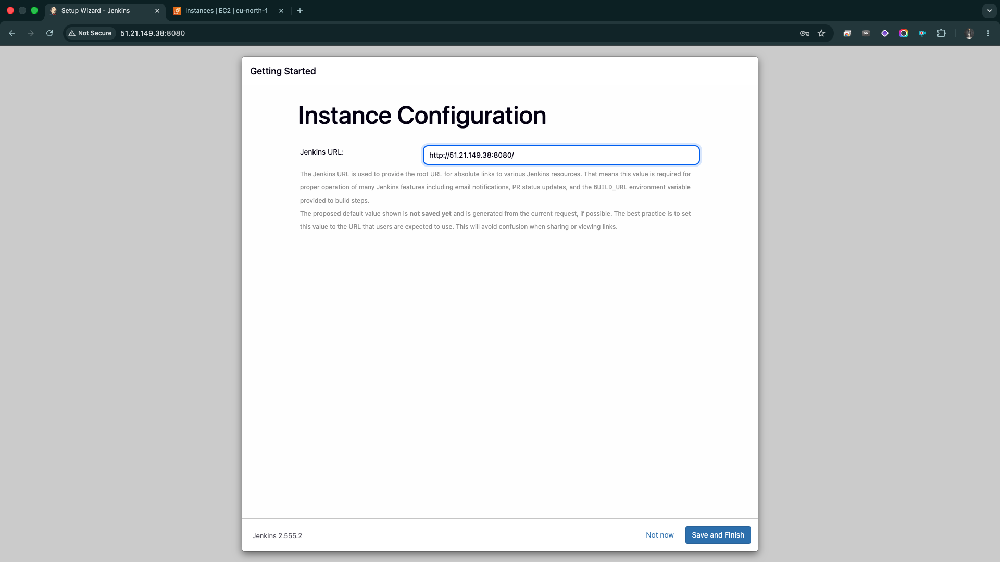

---

### Step 31 — The Jenkins Dashboard Was Reached

The Jenkins dashboard was displayed, confirming that the installation and initial setup were completed successfully. Jenkins **2.555.2** was running and ready for use.

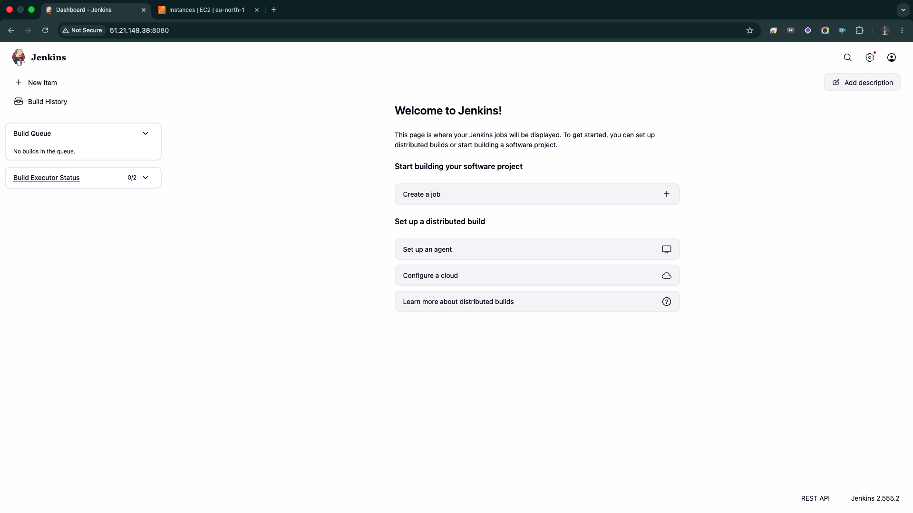

---

## Phase 3 — Jenkins Tools and Plugin Preparation

### Step 32 — A Connection to the Server Was Established

A new SSH session was opened to the EC2 instance to prepare the server with the tools required for a Java/Maven CI project:

```bash
ssh -i "ci-jenkins-key.pem" ubuntu@51.21.149.38
```

---

### Step 33 — Installed Tool Versions Were Checked

The versions of Git, Java, and Maven were checked on the server:

```bash
git --version
java -version
mvn -version
```

The following results were observed:

| Tool | Result |
|---|---|
| Git | `git version 2.43.0` — already installed |
| Java | OpenJDK `21.0.10` — already installed |
| Maven | Not found — installation required |

---

### Step 34 — Maven Was Installed

Because Maven was not present on the server, it was installed from the Ubuntu package repository:

```bash
sudo apt update
sudo apt install maven -y
```

---

### Step 35 — The Maven Installation Was Verified

The Maven installation was confirmed with:

```bash
mvn -version
```

The output showed **Apache Maven 3.8.7** running on **Java 21.0.10**.

---

### Step 36 — Installed Jenkins Plugins Were Reviewed

In the Jenkins web interface, the installed plugins were reviewed under **Manage Jenkins → Plugins → Installed plugins**.

The following plugins were confirmed as already available from the initial suggested plugins setup:

| Plugin | Status |
|---|---|
| Git | Already installed |
| Pipeline | Already installed |
| Workspace Cleanup | Already installed |
| Timestamper | Already installed |

The following required plugins were found to be missing:

| Plugin | Status |
|---|---|
| Maven Integration | Not installed |
| Pipeline Maven Integration | Not installed |
| Build Timestamp | Not installed |

SonarQube and Nexus plugins were intentionally not installed at this stage.

---

### Step 37 — The Missing Plugins Were Installed

The missing plugins were installed from **Manage Jenkins → Plugins → Available plugins**. Each plugin was searched by name, selected, and installed:

| Plugin | Action |
|---|---|
| Maven Integration | Installed |
| Pipeline Maven Integration | Installed |
| Build Timestamp | Installed |

SonarQube and Nexus plugins were not installed at this stage.

---

### Step 38 — Jenkins Was Restarted

After new plugins were installed, Jenkins prompted for a restart. **Restart Jenkins when installation is complete and no jobs are running** was selected.

---

### Step 39 — The Final Tool and Plugin Setup Was Confirmed

After the restart, the server and Jenkins were confirmed ready for a Java/Maven CI project.

**Tools on the server:**

| Tool | Version |
|---|---|
| Git | 2.43.0 |
| Java | OpenJDK 21.0.10 |
| Maven | 3.8.7 |

**Required Jenkins plugins:**

| Plugin | Status |
|---|---|
| Git | Installed |
| Pipeline | Installed |
| Maven Integration | Installed |
| Pipeline Maven Integration | Installed |
| Workspace Cleanup | Installed |
| Build Timestamp | Installed |

---

## Phase 4 — Local Maven Sample App

### Step 40 — The Tutorial Repository Was Cloned

The official Jenkins tutorial repository was cloned into the local project folder:

```bash
cd jenkins-ci-sample-app
```

---

### Step 41 — The App Folder Was Prepared

The cloned folder was kept as **`jenkins-ci-sample-app`**. The existing `.git` folder inside it was removed so a new Git history could be created later.

```bash
rm -rf jenkins-ci-sample-app/.git
```

---

### Step 42 — The Project Was Customized

The sample app was customized as a **Maven CI sample application** for this lab.

**`README.md`** was rewritten to describe the application and its build commands.

**`pom.xml`** was updated:

| Setting | Value |
|---|---|
| artifactId | `jenkins-ci-sample-app` |
| name | `jenkins-ci-sample-app` |

**`App.java`** and **`AppTest.java`** were updated to print and verify application name, status, environment, Java version, and build information.

The local Java and Maven versions were verified before building:

```bash
java -version
mvn -version
```

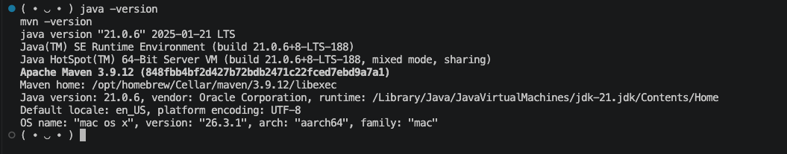

---

### Step 43 — The Unit Tests Were Run

The project was tested locally with Maven:

```bash
cd jenkins-ci-sample-app
mvn clean test
```

**Result:** 4 tests passed, 0 failures.

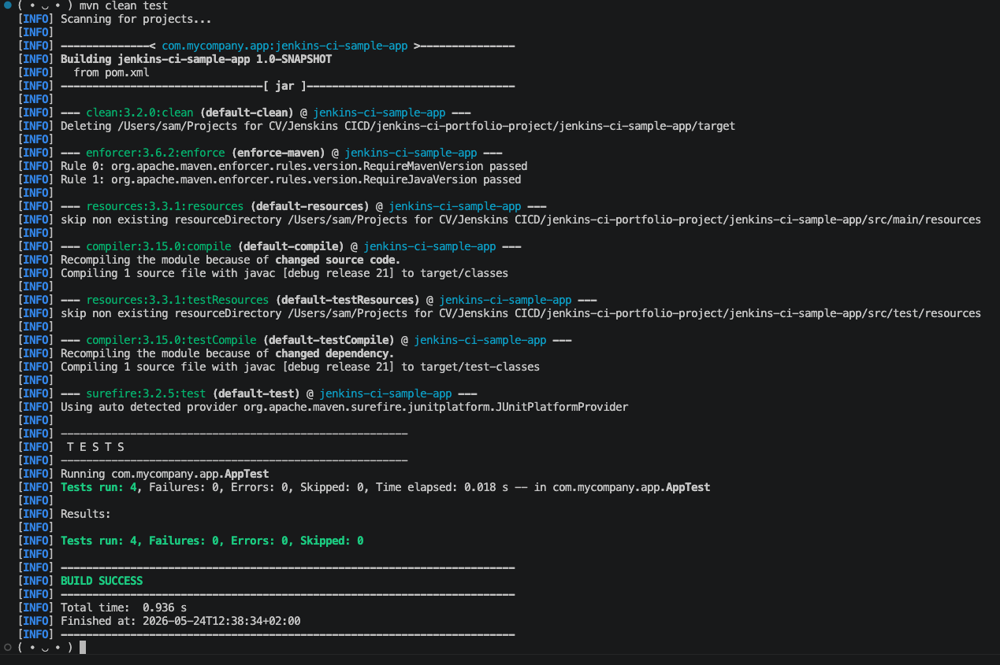

---

### Step 44 — The Application Was Packaged

A JAR file was built with:

```bash
mvn clean package
```

**Result:** `BUILD SUCCESS`

**Output file:**

```
target/jenkins-ci-sample-app-1.0-SNAPSHOT.jar
```

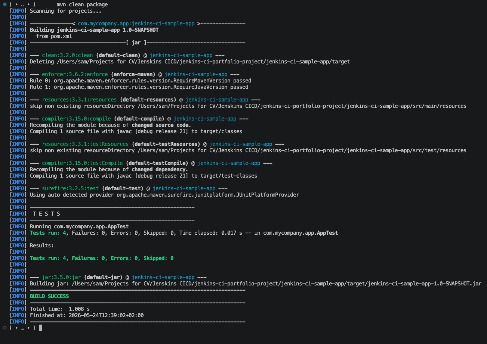

---

### Step 45 — The Application Was Run Locally

The packaged application was executed:

```bash
java -jar target/jenkins-ci-sample-app-1.0-SNAPSHOT.jar
```

The application build information was printed to the console.

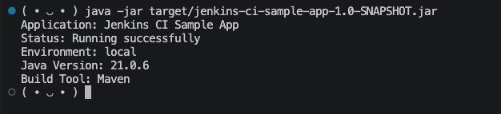

---

## Phase 5 — Jenkins CI Configuration

### Step 46 — Maven Was Configured in Global Tool Configuration

The server Maven (**3.8.7**) was older than the project requirement (**3.9.9+**), so a newer Maven was added under **Manage Jenkins → Global Tool Configuration → Maven installations**:

| Setting | Value |
|---|---|
| Name | `Maven-3.9` |
| Install automatically | Enabled |
| Installer | Install from Apache |
| Version | `3.9.10` |

**Save** was clicked.

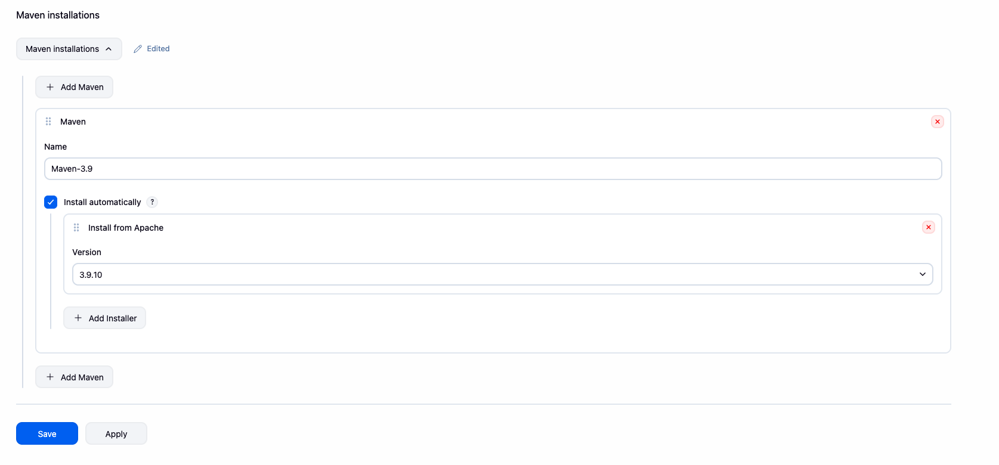

---

### Step 47 — A Freestyle Job Was Created and Configured

A **Freestyle project** named **`build-maven-sample-app`** was created. **Git** was set to:

```
https://github.com/SamParsakian/jenkins-ci-sample-app.git
```

A **Invoke top-level Maven targets** build step was added:

| Setting | Value |
|---|---|
| Maven Version | `Maven-3.9` |
| Goals | `clean package` |

---

### Step 48 — The First Build Failed and Build #2 Succeeded

**Build #1** failed as the server had the Java 21 **runtime** but not the **compiler** required by Maven.

**OpenJDK 21 JDK** was installed on the server:

```bash
sudo apt install openjdk-21-jdk -y
```

**JDK-21** was added under **Global Tool Configuration**, assigned to the job, and the build was run again.

**Build #2** finished with **SUCCESS**.

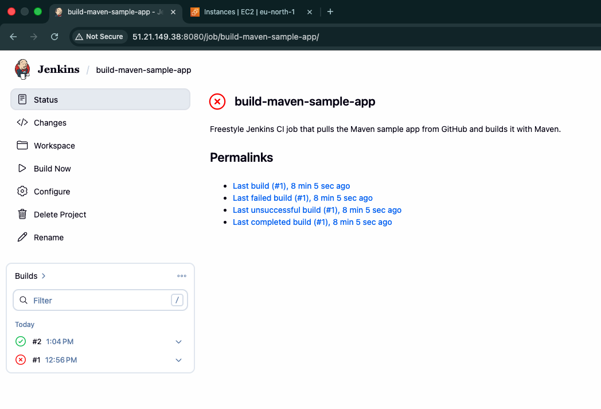

---

### Step 49 — Build Artifacts Were Archived

The **`build-maven-sample-app`** job was updated. Under **Post-build Actions**, **Archive the artifacts** was added with:

```
target/*.jar
```

The job was run again. **Build #3** finished with **SUCCESS**, and **`jenkins-ci-sample-app-1.0-SNAPSHOT.jar`** was saved as a build artifact.

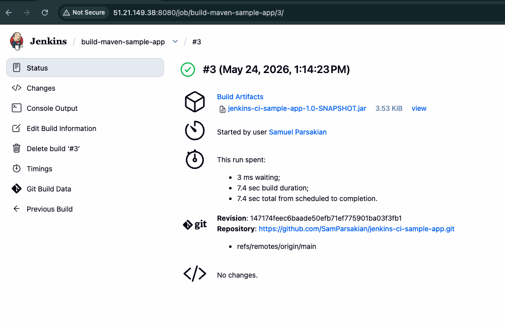

---

### Step 50 — A Root-Level Jenkinsfile Was Created

The CI flow was stored as code in the sample app repository. A **`Jenkinsfile`** was added at the **root** of **`jenkins-ci-sample-app`** with a declarative pipeline:

| Stage | Action |
|---|---|
| Checkout | `checkout scm` |
| Build and Test | `mvn clean package` |
| Archive Artifact | `target/*.jar` |

The pipeline used **`agent any`**. SonarQube and Nexus were not included at this stage.

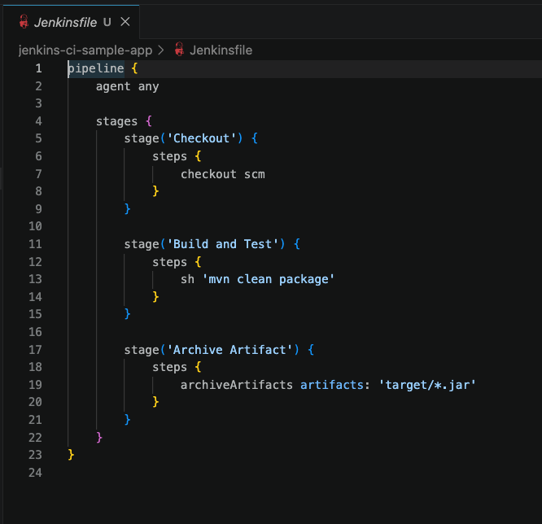

---

### Step 51 — The Jenkinsfile Was Pushed to GitHub

The updated repository was pushed to GitHub so Jenkins could use the root **`Jenkinsfile`** in a Pipeline job later. The file appeared in the repository next to the existing tutorial file under **`jenkins/`**.

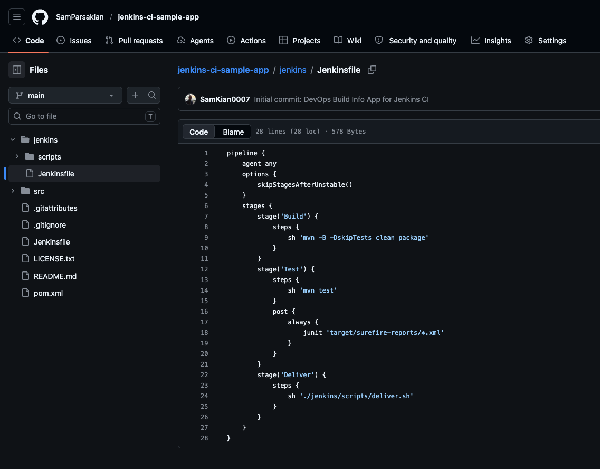

---

### Step 52 — A Pipeline Job Was Created

A **Pipeline** job named **`pipeline-maven-sample-app`** was created to load the root **`Jenkinsfile`** from:

```
https://github.com/SamParsakian/jenkins-ci-sample-app.git
```

**Build #1** failed as Jenkins used the server Maven (**3.8.7**) instead of the project requirement (**3.9.9+**).

---

### Step 53 — Pipeline Tools Were Configured and Build #2 Succeeded

A **`tools`** block was added to the **`Jenkinsfile`**:

| Tool | Name |
|---|---|
| Maven | `Maven-3.9` |
| JDK | `JDK-21` |

The change was pushed to GitHub.

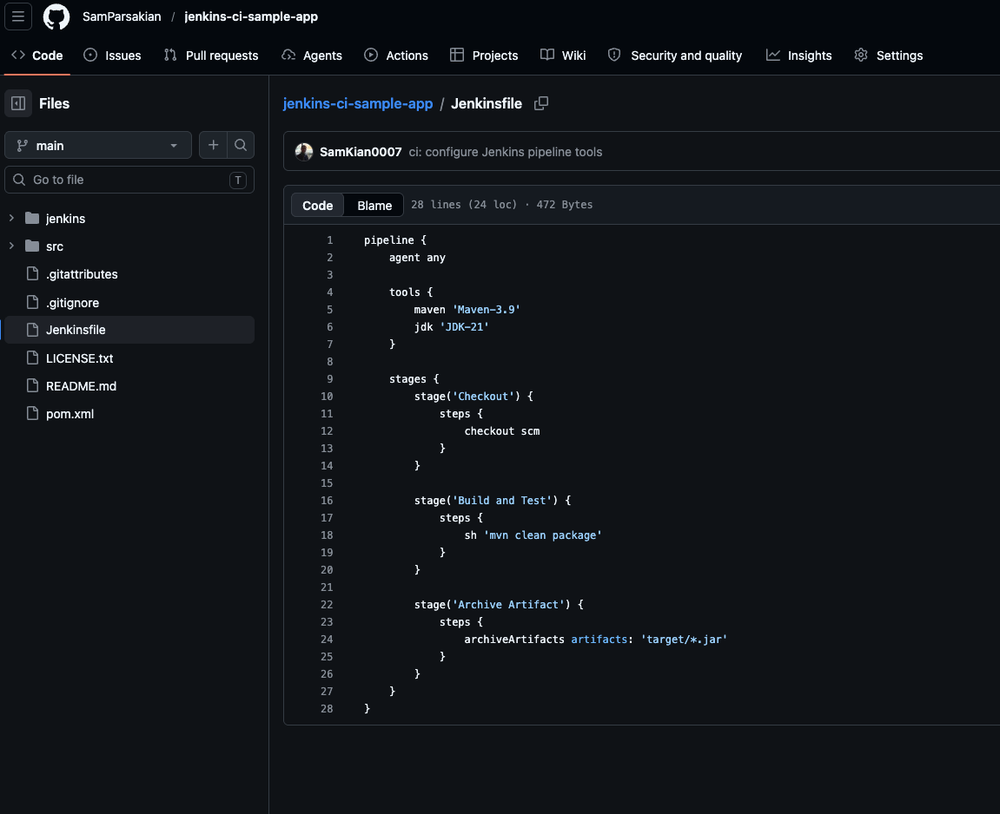

The pipeline job was run again. **Build #2** finished with **SUCCESS**, and **`jenkins-ci-sample-app-1.0-SNAPSHOT.jar`** was archived.

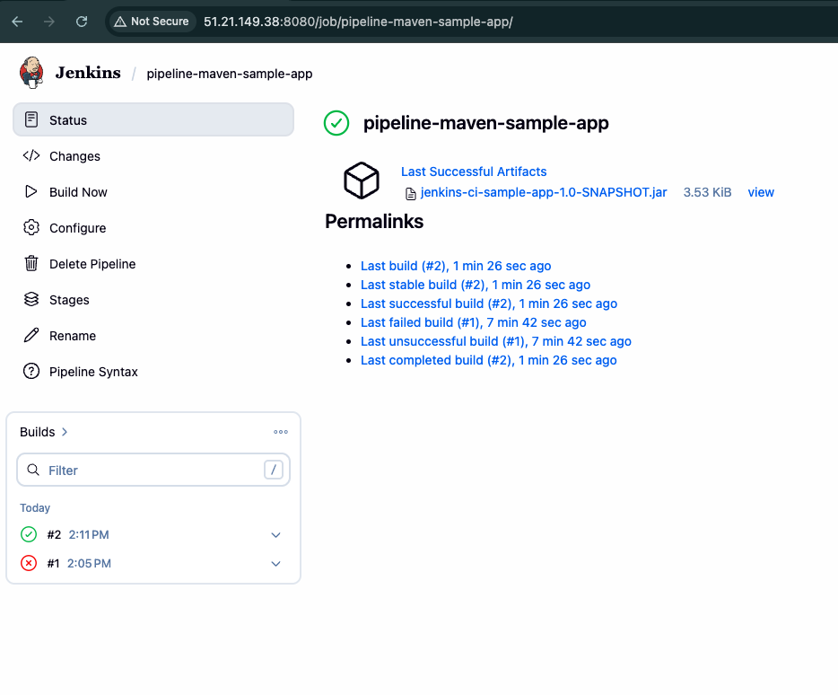

---

## Phase 6 — SonarQube Server Setup

### Step 54 — A SonarQube EC2 Instance Was Created

A separate EC2 instance was created for SonarQube, following a dedicated-server setup:

| Setting | Value |
|---|---|
| Instance name | `sonarqube-ci-server` |
| AMI | Ubuntu Server 24.04 LTS |
| Instance type | `t3.medium` |
| Key pair | `ci-jenkins-key` |
| Storage | 20 GiB |
| Security group | `sonarqube-ci-sg` |

**Inbound rules** for **`sonarqube-ci-sg`**:

| Port | Protocol | Source | Purpose |
|---|---|---|---|
| 22 | SSH | My IP | Server access |
| 9000 | Custom TCP | My IP | SonarQube web UI |
| 9000 | Custom TCP | Jenkins security group | Jenkins → SonarQube |

Both **`ci-jenkins-controller`** and **`sonarqube-ci-server`** were **Running**. Jenkins showed **2/2 checks passed**; SonarQube was still **Initializing**.

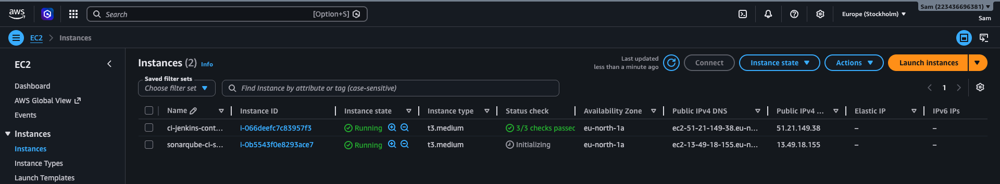

---

### Step 55 — SonarQube Scanner Plugin Was Installed

The **SonarQube Scanner** plugin was installed on Jenkins from **Manage Jenkins → Plugins** (version **2.18.2**).

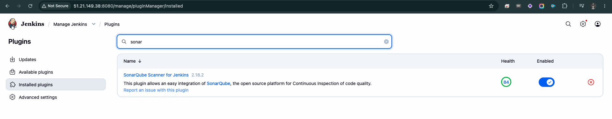

---

### Step 56 — Jenkins SonarQube Credentials and Server Were Configured

A **Secret text** credential was created for SonarQube:

| Setting | Value |
|---|---|
| Kind | Secret text |
| ID | `sonarqube-token` |
| Description | SonarQube token for Jenkins pipeline analysis |

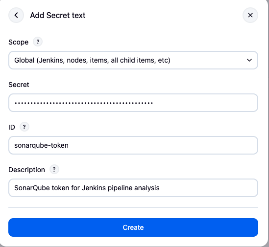

Under **Manage Jenkins → System**, a SonarQube server was added:

| Setting | Value |
|---|---|
| Name | `SonarQube-Server` |
| Server URL | `http://172.31.18.101:9000` |
| Server authentication token | `sonarqube-token` |

**Build #4** failed when the public IP was used. The server URL was changed to the SonarQube **private IP** so Jenkins could reach SonarQube inside the VPC.

---

### Step 57 — SonarQube Scanner Tool Was Configured

Under **Manage Jenkins → Global Tool Configuration**, **SonarQube-Scanner** was added with **Install automatically** from Maven Central.

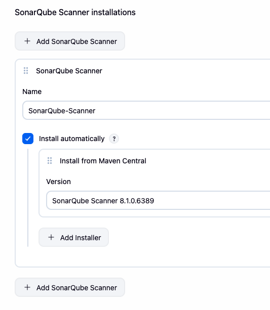

---

### Step 58 — SonarQube Analysis Stage Was Added to the Jenkinsfile

The root **`Jenkinsfile`** was updated with a **SonarQube Analysis** stage after **Build and Test**, using `withSonarQubeEnv('SonarQube-Server')` and `tool 'SonarQube-Scanner'` with project key **`jenkins-ci-sample-app`**.

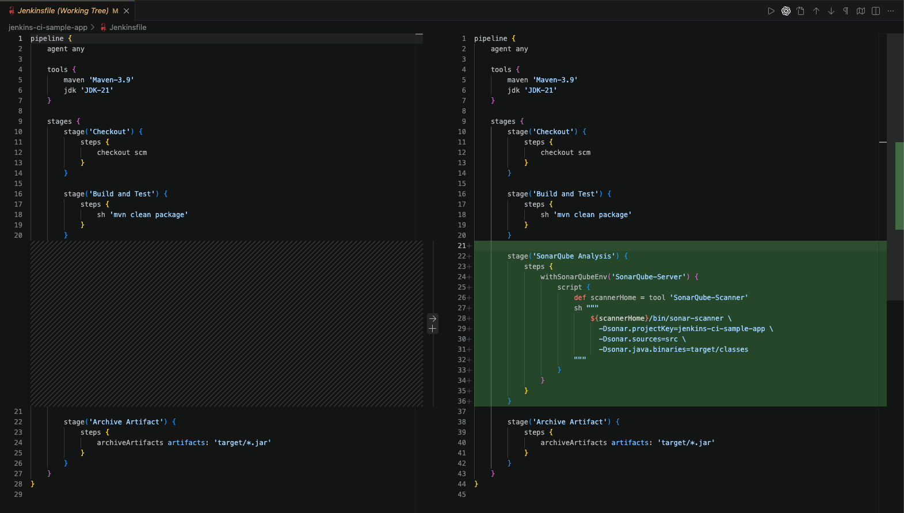

The change was pushed to GitHub and the **`pipeline-maven-sample-app`** job was run again.

---

### Step 59 — Pipeline Build #5 Passed the SonarQube Quality Gate

A SonarQube project **`jenkins-ci-sample-app`** was created. **Pipeline Build #5** finished with **SUCCESS**, and the SonarQube **Quality Gate** showed **Passed**.

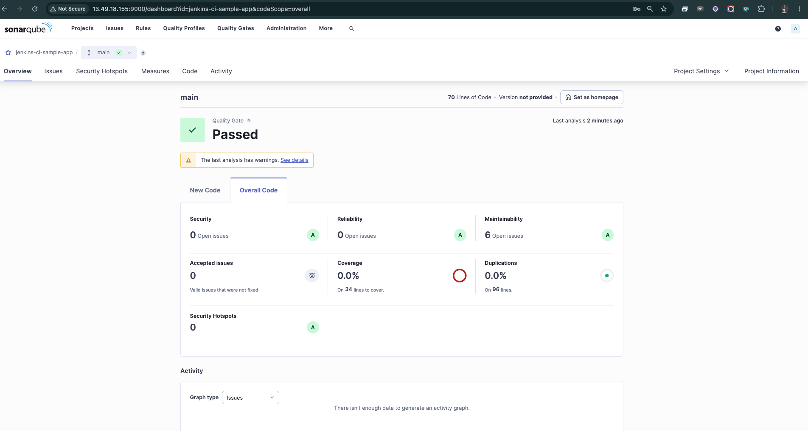

---

## Phase 7 — Nexus Repository Server Setup

### Step 60 — A Nexus EC2 Instance Was Launched

A third EC2 instance was launched for **Nexus Repository Manager**:

| Setting | Value |
|---|---|
| Instance name | `nexus-ci-server` |
| AMI | Ubuntu Server 24.04 LTS |
| Instance type | `t3.medium` |
| Key pair | `ci-jenkins-key` |
| Storage | 20 GiB |
| Security group | `nexus-ci-sg` |

**Inbound rules** for **`nexus-ci-sg`**:

| Port | Protocol | Source | Purpose |
|---|---|---|---|
| 22 | SSH | My IP | Server access |
| 8081 | Custom TCP | My IP | Nexus web UI |
| 8081 | Custom TCP | Jenkins security group | Jenkins → Nexus |

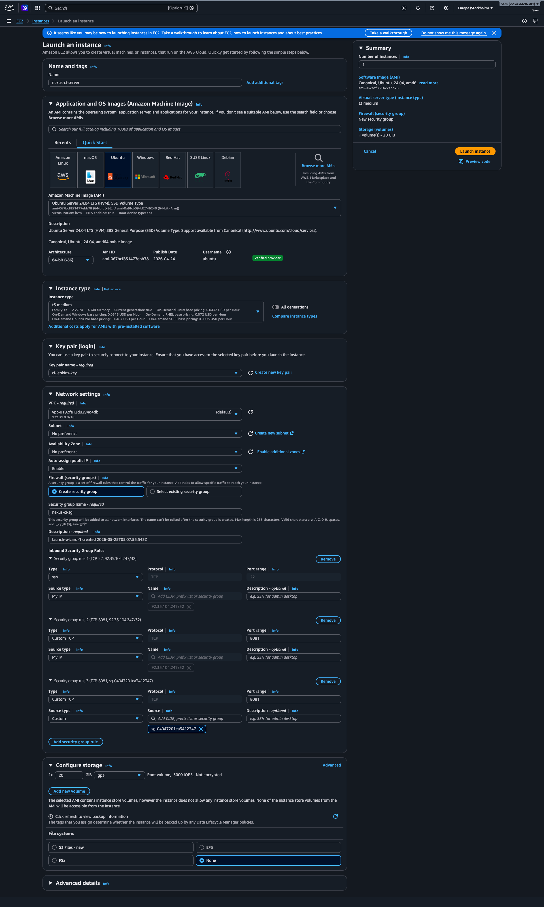

---

### Step 61 — The Nexus Instance Status Was Verified

After launch, three CI servers were visible on the EC2 **Instances** page:

| Instance | Status |
|---|---|
| `ci-jenkins-controller` | Running — 3/3 checks passed |
| `sonarqube-ci-server` | Running — 3/3 checks passed |
| `nexus-ci-server` | Running — **Initializing** |

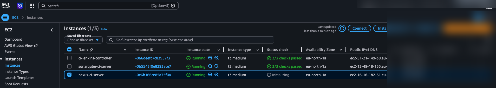

---

### Step 62 — Nexus Repository OSS Was Installed and Started

**Nexus Repository OSS** was installed on **`nexus-ci-server`** and configured to listen on port **8081**:

```
http://16.16.182.61:8081
```

Nexus did not start correctly with **Java 17**. **Java 11** was installed, the startup file was backed up, and **`INSTALL4J_JAVA_HOME_OVERRIDE`** was set to `/usr/lib/jvm/java-11-openjdk-amd64`. After restart:

| Check | Result |
|---|---|
| Service | `active (running)` |
| Port 8081 | Listening |
| HTTP | **200 OK** |

---

### Step 63 — Nexus First-Time Setup Was Completed

The Nexus web UI was opened in a browser. Login was completed as **`admin`**, the admin password was changed, and **Disable anonymous access** was selected.

Nexus was ready for repository creation.

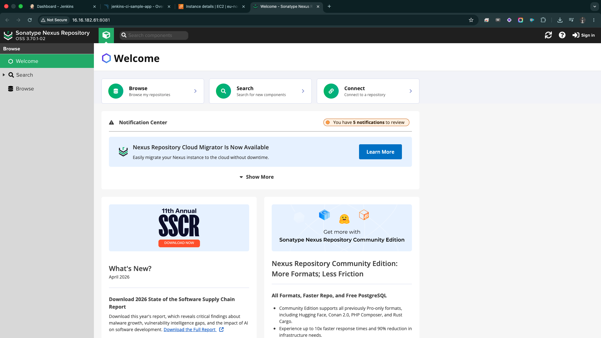

---

### Step 64 — A Maven Release Repository Was Created

A **Maven 2 (hosted)** repository was created first with **Release** version policy:

| Setting | Value |
|---|---|
| Name | `jenkins-maven-releases` |
| Format | `maven2` |
| Type | hosted |
| Deployment policy | Allow redeploy |
| Status | **Online** |

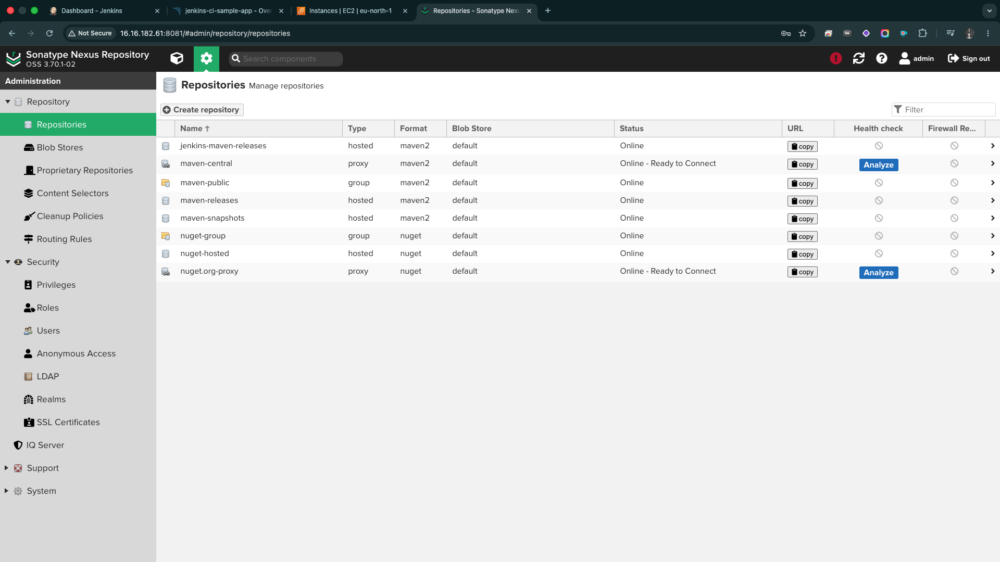

---

### Step 65 — A Maven Snapshot Repository Was Created

As the application version was **`1.0-SNAPSHOT`**, a second hosted repository was created with **Snapshot** version policy:

| Setting | Value |
|---|---|
| Name | `jenkins-maven-snapshots` |
| Format | `maven2` |
| Type | hosted |
| Deployment policy | Allow redeploy |
| Status | **Online** |

---

### Step 66 — Jenkins Nexus Credentials Were Added

A Jenkins credential was created for Nexus uploads:

| Setting | Value |
|---|---|
| Kind | Username with password |
| ID | `nexus-admin-creds` |
| Username | `admin` |

---

### Step 67 — The Jenkinsfile Upload Stage Was Fixed

An **Upload to Nexus** stage was added to the root **`Jenkinsfile`** using the private Nexus URL:

```
http://172.31.27.93:8081
```

Repository: **`jenkins-maven-snapshots`**

The first upload attempt used the Nexus **Components REST API** with **`curl`**. **Build #8–#10** failed with:

```
curl: (22) The requested URL returned error: 400
```

Nexus does not support REST upload to **Maven snapshot** repositories for **`1.0-SNAPSHOT`** artifacts. The stage was changed to **`mvn deploy:deploy-file`** with a temporary **`nexus-settings.xml`** and credential **`nexus-admin-creds`**.

---

### Step 68 — Pipeline Build #11 Succeeded

After the corrected **`Jenkinsfile`** was pushed, **`pipeline-maven-sample-app` Build #11** finished with **SUCCESS**. The SonarQube **Quality Gate** showed **Passed**, and the JAR was archived in Jenkins.

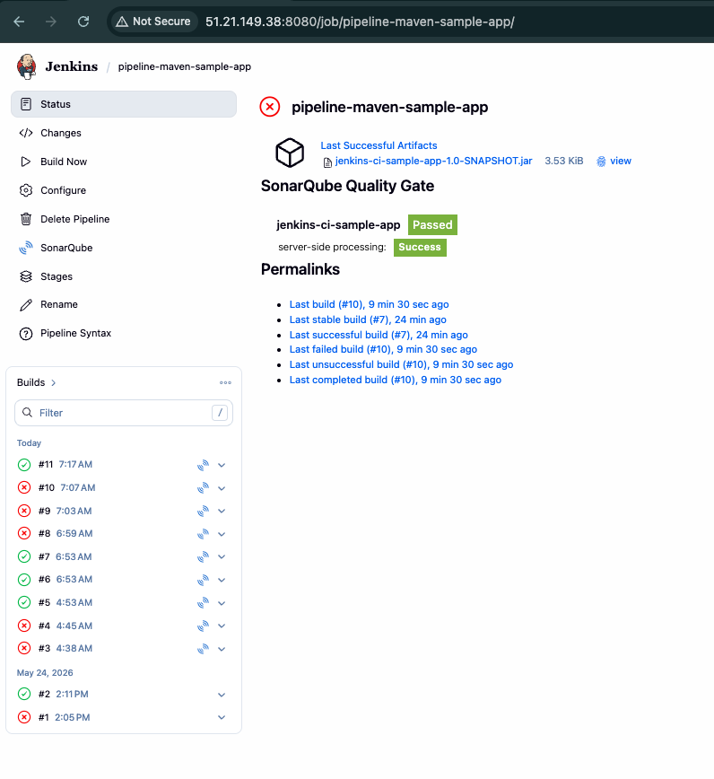

---

### Step 69 — The JAR Artifact Was Confirmed in Nexus

The uploaded artifact was confirmed in **`jenkins-maven-snapshots`**:

```
com/mycompany/app/jenkins-ci-sample-app/1.0-SNAPSHOT
```

The full CI flow was working: GitHub → Jenkins → Maven build/test → SonarQube → Jenkins archive → Nexus upload.

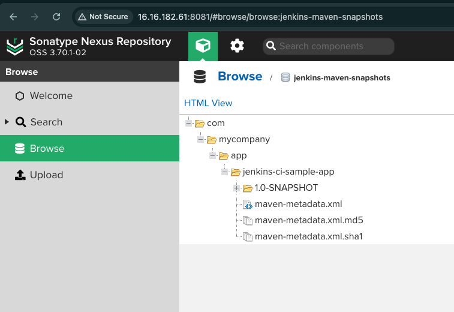

---

## Screenshot index

Screenshots exist only for the steps listed below. No extra images were added.

| Step | Screenshot file |
|---|---|
| 10 | `10-ec2-instance-running.png` |
| 11 | `11-ec2-ssh-connect.png` |
| 17 | `17-jenkins-official-docs.png` |
| 26 | `26-jenkins-unlock.png` |
| 27 | `27-jenkins-plugins-install.png` |
| 28 | `28-jenkins-instance-config.png` |
| 29 | `29-jenkins-dashboard.png` |
| 42 | `42-local-java-maven-versions.png` |
| 43 | `43-maven-clean-test.png` |
| 44 | `44-maven-clean-package.png` |
| 45 | `45-app-run-local.png` |
| 46 | `46-jenkins-maven-global-tool-config.png` |
| 48 | `48-jenkins-freestyle-build-success.png` |
| 49 | `49-jenkins-artifact-archive-build-3.png` |
| 50 | `50-jenkinsfile-root-created.png` |
| 51 | `51-jenkinsfile-on-github.png` |
| 52 | `52-jenkinsfile-pipeline-tools-github.png` |
| 53 | `53-pipeline-build-2-success.png` |
| 54 | `54-sonarqube-ec2-instances.png` |
| 55 | `55-jenkins-sonarqube-plugin-installed.png` |
| 56 | `56-jenkins-sonarqube-token-credential.png` |
| 57 | `57-jenkins-sonarqube-scanner-tool.png` |
| 58 | `58-jenkinsfile-sonarqube-stage.png` |
| 59 | `59-sonarqube-quality-gate-passed.png` |
| 60 | `60-nexus-ec2-launch-config.png` |
| 61 | `61-nexus-ec2-instances-running.png` |
| 62 | `62-nexus-welcome-page.png` |
| 64 | `64-nexus-jenkins-maven-releases-repository.png` |
| 65 | `65-jenkins-pipeline-build-11-success.png` |
| 66 | `66-nexus-snapshot-artifact-uploaded.png` |

---

*End of setup report — Jenkins CI pipeline with Maven, SonarQube, and Nexus.*
